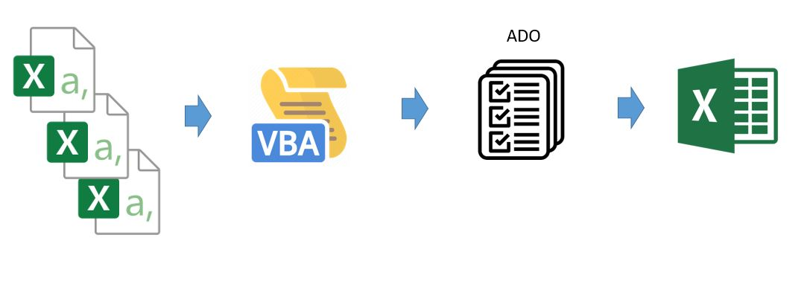

<h2>Faster-ETL-When-You-Work-in-Excel</h2>
<h3>Intro</h3>

In this project I take advantage of ADO which stands for ActiveX Data Obecjts. If you work with Excel and you need to get a data into your wokrsheet, ADO makes any type of data source accessible for you. It can be SQL Server, Access data base, or regular Excel worksheet.

A lot of work in excel depends on copy pasting data from excel to excel. Doing it manually, requires you to open each excel, copy data, and append the data to an exitistig one and close the source. We can simply automate this steps by writing a macro. However the mistake that people make is duplicating those steps in the code, having to open and close source excel. It is ok when you have 1, 2 or 3 sources excel. However when you work with multiple excels, this may be consuming a lot of time. Especially when you copy data by selecting range and making a copy method on it. That prolongs whole process as well.

Here comes ADO to make it faster without opening each excel and without selecting range to copy in every source. With ADO you can just query Excel like any other SQL or Access database. That saves you a lot of time an ensures data integrity as there is no risk of selecting wrong range or too large or to small range of data to be copied.

<h3>Demo</h3>
<ul>
  <li>No need for making any references - ADODB created with late binding method.</li>
  <li>We need to get connection string:
    <ul>
      <li>Provider=Microsoft.ACE.OLEDB.12.0;Data Source=$c:\myFolder\myExcel2007file.xlsx$; Extended Properties="Excel 12.0 Xml;HDR=YES";</li>
      <li>I replaced $c:\myFolder\myExcel2007file.xlsx$ with following: ThisWorkbook.FullName</li>
    </ul>
  </li>
  <li>We define data source within SQL string query.</li>
  <li>Let's say we want to retrieve all the data from worksheet Sales in data.xlsx. Then, the query should look like below:
    <ul>
      <li>SELECT * FROM [Excel 12.0;HDR=YES;DATABASE=C:\Users\U742905\Documents\etl_with_excel\data.xlsx].[Sales$]</li>
      <li>Note the notation of worksheet name which is: [worksheet_name$].</li>
      <li>Worksheet should contain only one excel table which we selecting data from.</li>
    </ul>
  </li>
</ul>

